<!-- @format -->

# Veo Video Generation API Backend


<div align="center">


 ♥️

[](https://opensource.org/licenses/MIT)
[](http://makeapullrequest.com)
[](https://nodejs.org)

</div>

## 🎬 About

A production-ready Express.js backend API for **Google Vertex AI Veo 3** video generation, featuring Firebase authentication, YouTube integration, and Cloud Run deployment. Generate AI-powered videos from text prompts with enterprise-grade security and scalability.

> This backend is **not tied to Android**. Android examples are provided for convenience only.

## 🌍 Client Compatibility

This API is platform-agnostic and can be used by:

- Android applications
- iOS applications
- Web applications (React, Next.js, Vue)
- Desktop apps (Electron, Flutter) and server-side clients
- Postman / curl

Any client capable of making authenticated HTTP requests can use this backend.

## ⚡ Quick Summary

- **Multi-platform**: Android, iOS, Web (React/Next/Vue), Desktop (Electron/Flutter), Postman/curl.
- **Auth**: `Authorization: Bearer <Firebase ID Token>`.
- **REST API**: Not tied to any specific platform.

## 💰 Pricing & Free Credits (IMPORTANT)

### Google Cloud Free Credits

Google provides **$300 USD in free credits** for **new Google Cloud accounts**.

These credits can be used for:

- Vertex AI (Veo video generation)
- Cloud Run
- Cloud Storage
- Networking and logging

➡️ This allows developers to **experiment and build prototypes at zero cost** initially.

### Video Generation Cost Notes

Video generation cost depends on:

- Video duration (seconds)
- Resolution & FPS
- Generation mode:
  - Text-to-Video
  - Image-to-Video
  - Video-to-Video (future)

⚠️ **Important Notes**

- This backend does **NOT** guarantee fixed pricing.
- Costs are billed directly by Google Cloud.
- Always monitor usage in **Google Cloud Console → Billing → Vertex AI**.

### Recommended Cost Controls

- Limit duration (4–6 seconds recommended)
- Disable high FPS by default
- Enforce daily user quotas
- Monitor usage daily

## 🎯 Use Cases

- AI Video generation apps
- Social media content tools
- Chat-based video assistants
- Android / iOS creative apps

## 🚀 Features

- **🎥 AI Video Generation**: Powered by Google Vertex AI Veo 3.1 model
- **🔒 Firebase Authentication**: Secure user management and JWT token verification
- **📱 Mobile Ready**: CORS-enabled API designed for Android/iOS applications
- **☁️ Cloud Native**: Deployed on Google Cloud Run with auto-scaling
- **🎞️ YouTube Integration**: Optional OAuth flow for direct video uploads
- **⚡ Rate Limiting**: Per-user request throttling and daily quotas
- **📊 Comprehensive Logging**: Structured logging with Winston
- **🛡️ Security First**: Helmet.js security headers and input validation
- **🐳 Docker Ready**: Multi-stage Docker build for optimal performance

## 🏗️ Architecture

```text
┌──────────────────────────────────────────┐
│                Clients                   │
│                                          │
│  Android • iOS • Web • Desktop • Postman │
│                                          │
│ ┌─────────────┐   ┌──────────────────┐  │
│ │Firebase Auth│◄──►│ Authorization    │  │
│ └─────────────┘   │  Bearer Token     │  │
└──────────────────────────────────────────┘
               │
               ▼
┌──────────────────────────────────────────┐
│              Veo Backend API             │
│          (Node.js + Express)             │
│               Cloud Run                  │
│                                          │
│ ┌──────────────┐  ┌──────────────────┐  │
│ │Auth Middleware│  │ Rate Limiter     │  │
│ └──────────────┘  └──────────────────┘  │
│                                          │
│ ┌──────────────┐  ┌──────────────────┐  │
│ │ Video Routes  │◄─►│ Job Status API  │  │
│ └──────────────┘  └──────────────────┘  │
│                                          │
│ ┌──────────────┐                         │
│ │ YouTube OAuth │ (Optional)             │
│ └──────────────┘                         │
└──────────────────────────────────────────┘
               │
               ▼
┌──────────────────────────────────────────┐
│           Google Cloud Platform          │
│                                          │
│ ┌──────────────────┐  ┌──────────────┐  │
│ │ Vertex AI Veo 3.1 │  │ Cloud Storage│  │
│ │ Video Generation  │  │ (Temporary)  │  │
│ └──────────────────┘  └──────────────┘  │
└──────────────────────────────────────────┘
```

### High-Level Architecture

```mermaid
graph TB

Clients["Clients\nAndroid · iOS · Web · Desktop"]
Auth["Firebase Auth"]
API["Veo Backend API\n(Cloud Run)"]
Rate["Rate Limiter"]
Video["Video Routes"]
Vertex["Vertex AI Veo 3.1"]
Storage["Cloud Storage"]

Clients --> Auth
Auth --> API
API --> Rate
Rate --> Video
Video --> Vertex
Vertex --> Storage
Storage --> Clients
```



> This architecture is client-agnostic. Any platform capable of making authenticated HTTP requests can use this API.

## 📋 Prerequisites

- **Node.js**: Version 20.0.0 or higher
- **pnpm**: Package manager (or npm/yarn)
- **Google Cloud Account**: With Vertex AI API enabled
- **Firebase Project**: For authentication
- **Docker**: For containerization (optional)

## 🛠️ Installation

### 1. Clone Repository

```bash
git clone https://github.com/msr7799/veo-backend.git
cd veo-backend
```

### 2. Install Dependencies

```bash
pnpm install
```

### 3. Environment Configuration

Create `.env` file in the project root:

```env
# Google Cloud Configuration
GCP_PROJECT_ID=your-project-id
GCP_REGION=us-central1

# Firebase Configuration
FIREBASE_PROJECT_ID=your-firebase-project-id

# Veo Model Configuration
VEO_MODEL_ID=veo-3.1

# Google Cloud Storage
GCS_BUCKET_NAME=your-bucket-name

# Server Configuration
PORT=8080
NODE_ENV=development

# Rate Limiting
RATE_LIMIT_WINDOW_MS=60000
RATE_LIMIT_MAX_REQUESTS=100

# User Quota
USER_DAILY_QUOTA=50

# YouTube OAuth (Optional)
YOUTUBE_CLIENT_ID=your-client-id
YOUTUBE_CLIENT_SECRET=your-client-secret
YOUTUBE_REDIRECT_URI=https://your-domain.com/oauth/youtube/callback
```

⚠️ **Cloud Run Note**  
Do **NOT** manually set `PORT` in Cloud Run.  
Cloud Run injects it automatically.

### 4. Google Cloud Setup

```bash
# Install Google Cloud CLI
# https://cloud.google.com/sdk/docs/install

# Authenticate
gcloud auth login
gcloud auth application-default login

# Set project
gcloud config set project YOUR_PROJECT_ID

# Enable APIs
gcloud services enable aiplatform.googleapis.com
gcloud services enable storage-api.googleapis.com
gcloud services enable run.googleapis.com
```

### 5. Firebase Setup

1. Create Firebase project at [Firebase Console](https://console.firebase.google.com)
2. Enable Authentication with desired providers
3. Download service account key (for local development only)
4. Set `GOOGLE_APPLICATION_CREDENTIALS` environment variable (local only)

## 🚀 Development

### Local Development

```bash
# Start development server
pnpm run dev

# The server will start at http://localhost:8080
```

### Production Build

```bash
# Build for production
pnpm install --prod

# Start production server
pnpm start
```

## 🐳 Docker Deployment

### Build Image

```bash
docker build -t veo-backend .
```

### Run Container

```bash
docker run -p 8080:8080 \
  -e GCP_PROJECT_ID=your-project-id \
  -e FIREBASE_PROJECT_ID=your-firebase-project-id \
  -e GCS_BUCKET_NAME=your-bucket-name \
  veo-backend
```

## ☁️ Cloud Run Deployment

### 1. Deploy to Cloud Run

```bash
# Deploy from source
gcloud run deploy veo-backend \
  --source . \
  --region us-central1 \
  --allow-unauthenticated \
  --service-account your-service-account@project.iam.gserviceaccount.com
```

### 2. Set Environment Variables

```bash
# Create env.yaml file
cat > env.yaml << EOF
GCP_PROJECT_ID: your-project-id
FIREBASE_PROJECT_ID: your-firebase-project-id
VEO_MODEL_ID: veo-3.1
GCS_BUCKET_NAME: your-bucket-name
NODE_ENV: production
EOF

# Update service with environment variables
gcloud run services update veo-backend \
  --region us-central1 \
  --env-vars-file env.yaml
```

## 📡 API Reference

### Base URL

```
https://your-service-url.run.app
```

### Authentication

All protected endpoints require Firebase authentication:

```
Authorization: Bearer <firebase_id_token>
```

### Endpoints

#### Health Check

```http
GET /v1/health
```

#### Get Supported Modes

```http
GET /v1/video/modes
```

#### Generate Video from Text

```http
POST /v1/video/text
Content-Type: application/json
Authorization: Bearer <firebase_token>

{
  "prompt": "A beautiful sunset over the ocean",
  "durationSeconds": 6,
  "aspectRatio": "16:9",
  "fps": 24
}
```

#### Check Job Status

```http
GET /v1/video/status/{jobId}
Authorization: Bearer <firebase_token>
```

#### YouTube OAuth (Optional)

```http
GET /v1/youtube/auth
Authorization: Bearer <firebase_token>
```

⚠️ **Important YouTube OAuth Security**

- YouTube OAuth must use a **Web OAuth Client**
- Android OAuth must **NOT** be used for uploads
- All OAuth flows must go through the backend

## 🔄 Request Flow


## 📱 Android Integration

### 1. Add Dependencies

```gradle
// Firebase Authentication
implementation 'com.google.firebase:firebase-auth:22.3.0'

// HTTP Client
implementation 'com.squareup.retrofit2:retrofit:2.9.0'
implementation 'com.squareup.retrofit2:converter-gson:2.9.0'
```

### 2. Initialize Firebase

```kotlin
// Configure Firebase in your app
FirebaseApp.initializeApp(this)
```

### 3. Get Authentication Token

```kotlin
FirebaseAuth.getInstance().currentUser?.getIdToken(true)
    ?.addOnSuccessListener { result ->
        val token = result.token
        // Use token for API calls
    }
```

### 4. Make API Calls

```kotlin
interface VeoApiService {
    @POST("v1/video/text")
    suspend fun generateVideo(
        @Header("Authorization") token: String,
        @Body request: VideoRequest
    ): Response<VideoResponse>

    @GET("v1/video/status/{jobId}")
    suspend fun getJobStatus(
        @Header("Authorization") token: String,
        @Path("jobId") jobId: String
    ): Response<JobStatusResponse>
}
```

> **Note**: Android example uses Retrofit for simplicity. The actual Chat UI project uses HttpURLConnection and OkHttp SSE.

## 🌐 Web Integration (React / Next.js / Vue)

This backend can be used directly from any web application.

### Example (JavaScript / Fetch)

```js
const token = await firebase.auth().currentUser.getIdToken();

await fetch(`${VEO_BACKEND_BASE_URL}/v1/video/text`, {
  method: "POST",
  headers: {
    Authorization: `Bearer ${token}`,
    "Content-Type": "application/json",
  },
  body: JSON.stringify({
    prompt: "Cinematic sunset over the desert",
    durationSeconds: 6,
    aspectRatio: "16:9",
    fps: 24,
  }),
});
```

## 🍏 iOS Integration (Swift)

Firebase Authentication on iOS works exactly the same.

```swift
Auth.auth().currentUser?.getIDToken { token, error in
    guard let token = token else { return }

    var request = URLRequest(
        url: URL(string: "\(baseUrl)/v1/video/text")!
    )
    request.httpMethod = "POST"
    request.setValue("Bearer \(token)", forHTTPHeaderField: "Authorization")
    request.setValue("application/json", forHTTPHeaderField: "Content-Type")

    request.httpBody = ...
}
```

## 🖥️ Server-to-Server Usage

This API can also be consumed by:

- Backend services
- Cron jobs
- Automation pipelines
- Admin dashboards

As long as a valid Firebase ID Token is provided, the API can be accessed securely.

## 🔒 Security Considerations

- **No Hardcoded Secrets**: All sensitive data stored in environment variables
- **Firebase Token Validation**: JWT tokens verified on every request
- **Rate Limiting**: Per-user request limits prevent abuse
- **CORS Configuration**: Restricted to allowed origins
- **Input Validation**: All request parameters validated
- **Security Headers**: Helmet.js security headers and input validation
- **Security Headers**: Helmet.js provides security headers
- **Non-root Container**: Docker runs as non-privileged user

## 📊 Monitoring & Logging

- **Structured Logging**: Winston logger with JSON format
- **Request Tracking**: All requests logged with duration and status
- **Error Handling**: Centralized error handling with detailed error types
- **Health Checks**: Multiple health endpoints for monitoring
- **Performance Metrics**: Request duration and user activity tracking

## 🚨 Error Handling

The API returns structured error responses:

```json
{
  "success": false,
  "error": {
    "type": "VALIDATION_ERROR",
    "message": "Invalid prompt length"
  }
}
```

Common error types:

- `VALIDATION_ERROR`: Invalid request parameters
- `AUTHENTICATION_ERROR`: Invalid or missing Firebase token
- `QUOTA_EXCEEDED`: User has exceeded daily limit
- `RATE_LIMIT_EXCEEDED`: Too many requests
- `YOUTUBE_NOT_CONFIGURED`: YouTube feature not available

## 🤝 Contributing

1. Fork the repository
2. Create a feature branch (`git checkout -b feature/amazing-feature`)
3. Commit your changes (`git commit -m 'Add amazing feature'`)
4. Push to the branch (`git push origin feature/amazing-feature`)
5. Open a Pull Request

## 📄 License

This project is licensed under the MIT License - see the [LICENSE](LICENSE) file for details.

## 🙋‍♂️ Support

For support and questions:

- Create an [issue](https://github.com/msr7799/veo-backend/issues)
- Check the [documentation](https://github.com/msr7799/veo-backend/wiki)
- Review [API examples](https://github.com/msr7799/veo-backend/tree/main/examples)

## 🔧 Development Status

- ✅ Text-to-video generation
- ✅ Firebase authentication
- ✅ YouTube OAuth integration
- ✅ Rate limiting & quotas
- ✅ Cloud Run deployment
- ⏳ Image-to-video (code-ready, feature-flagged OFF)
- ⏳ Video-to-video (not implemented yet)

## 🗺️ Roadmap

- [ ] Image-to-video
- [ ] Video-to-video
- [ ] Video gallery
- [ ] Chat-integrated video messages
- [ ] Advanced generation controls

---

<div align="center">

**Built with ♥️**

[⭐ Star this repository](https://github.com/msr7799/veo-backend) if you found it helpful!

</div>
